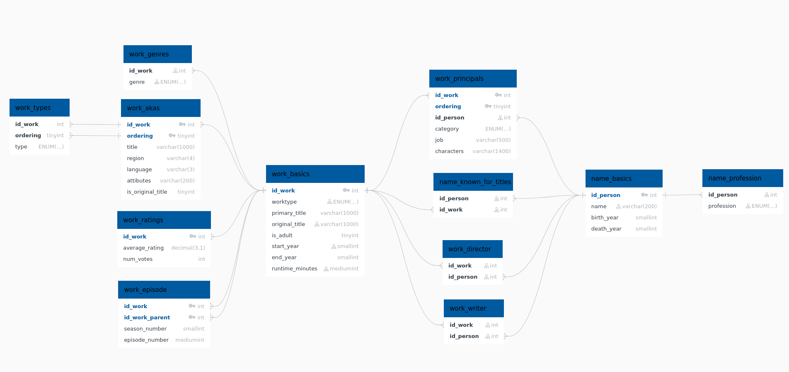

# Load


- Postgres tables
    - 
- Neo4J structure:
    - ?

- Sources :
    - https://kxs.fr/cours/bd/imdb
        - https://kxs.fr/outils/imdb-database
            - Tables: https://datasets.imdbws.com/
    - Remark: I've modified `original_script_from_website.py` to `imbd_to_psql.py`.

## Installation

### Rebuild everything from scratch

```bash
# To execute all the following commands once
make all

# Download
make download
make decompress

# Glimpse to raw data
make glimpse

# to PSQL
make process    # create .sql in ./data
make psql_load  # load .sql files into postgres

# to Neo4J
make psql_to_neo4j
```

### Load a glimpse of Neo4j

```bash
```